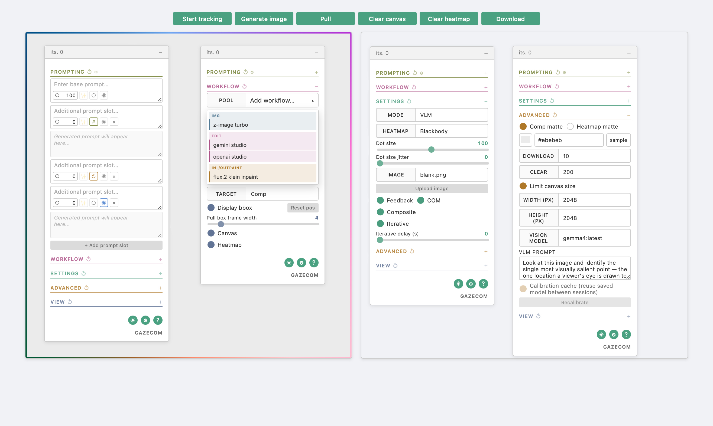

# gazeCOM

gazeCOM is a local React/TypeScript application for tracking-driven image
generation and spatial composition. It uses spatial data produced by different
tracking modes to define the region processed by the image model and where the
result is anchored on a composite canvas.

Tracking is organized around two drivers:

- **Interactive modes** build temporal saliency from gaze movements, hand
  gestures, cursor input, camera-based computer vision, or algorithmic
  movement.
- **VLM** derives saliency from a vision model's analysis of the image or
  composite.

gazeCOM connects to [ComfyUI](https://github.com/comfyanonymous/ComfyUI) for
image generation and to [Ollama](https://ollama.com/) for language and vision
models.

> Current version: v0.3.1



[How it works](#how-it-works) · [Install](#install) ·
[Technical overview](#technical-overview) · [Quick start](#quick-start) ·
[Settings and data](#settings-and-data) · [Documentation](#documentation) ·
[Build from source](#build-from-source)

## How it works

1. The selected driver supplies one or more saliency points.
2. The points accumulate into a saliency heatmap.
3. Their weighted spatial distribution determines the center of mass (COM),
   which becomes the driving coordinate.
4. A 1024 x 1024 region centered on COM is submitted to ComfyUI.
5. The generated patch is placed at the corresponding canvas position.
6. Iterative mode repeats the pipeline from the updated state.

The composite operates on an infinite canvas with optional width and height
limits.

> **Tip:** **Pull** is a separate canvas control that extracts the currently
> positioned 1024 x 1024 frame from the composite as the next working image.

## Install

Download and extract the latest build from
[Releases](https://github.com/grebenshyo/gazecom/releases).

- **Windows:** run `gazeCOM.exe`.
- **Apple Silicon:** download `gazeCOM-macos-arm64.zip` and open
  `gazeCOM.command`.
- **Intel macOS:** download `gazeCOM-macos-intel.zip` and open
  `gazeCOM.command`.

The application starts a local server in a terminal window and opens gazeCOM in
the browser. Close the terminal or press **Ctrl-C** to stop it.

The builds are unsigned. On Windows, choose **More info > Run anyway** if
SmartScreen appears. On macOS, right-click `gazeCOM.command` and choose
**Open** on first launch. If macOS still blocks it, open **System Settings >
Privacy & Security** and choose **Open Anyway**.

Custom workflows are loaded from:

- macOS: `~/Library/Application Support/gazeCOM/workflows/`
- Windows: `%APPDATA%\gazeCOM\workflows\`

### Requirements

| Service | Used for |
|---|---|
| **ComfyUI** | Image generation; required and reachable over HTTP |
| **Ollama** | VLM, prompt enhancement, and vision prompting; optional |

gazeCOM includes an API-format Edit workflow for **FLUX.2 Klein 9B INT8
ConvRot**. It expects the following model files in ComfyUI:

- Diffusion model: `FLUX.2-Klein-9B-INT8-ConvRot.safetensors`
- Text encoder: `qwen_3_8b_fp8mixed.safetensors`
- VAE: `flux2-vae.safetensors`

The models and nodes referenced by any additional or override workflow must
also be available in ComfyUI.

ComfyUI and Ollama may run locally or on the network. Service addresses are
configured under **Settings > General**.

> **Remote ComfyUI:** start the server with `--listen`.

## Technical overview

### Interactive driver

The Interactive driver includes six tracking modes:

| Mode | Tracking signal |
|---|---|
| **WebGazer** | Webcam-based gaze estimation after five-point calibration |
| **Handpose** | Five fingertip positions detected from the camera |
| **Cursor** | Pointer movement within the tracking frame |
| **MSI** | Computer-vision saliency inferred from the camera |
| **Roam** | Continuous algorithmic roaming |
| **Adaptive Roam** | An alternative roamer that alternates exploratory, focused, and scanning movement |

### VLM driver

The VLM driver derives spatial tracking from a vision model's analysis.

It provides two behaviors:

| Behavior | Function |
|---|---|
| **Point** | Tracks a VLM-derived saliency point in the latest frame or complete composite; the regular weighted prompt pool supplies the generation text |
| **Guide** | Uses the vision model to define COM framing across the complete composite and applies the selected prompt strategy |

Guide provides four prompt strategies:

| Strategy | Function |
|---|---|
| **Rotate** | Rotates prompts by normalized weight; optional pool context shows the VLM which prompts are shaping the image |
| **Select** | Lets the VLM choose one unmuted prompt from the pool, independent of weight |
| **Compose** | Lets the VLM write a new generation prompt |
| **Hybrid** | Lets the VLM choose between a pool prompt and a newly written prompt |

Guide can retain a bounded text history of previous decisions. Optional visual
memory sends the immediately preceding canvas alongside the current canvas.

### Prompting

Prompt slots form a normalized weighted pool. Entries can be muted without
changing their values.

Each prompt slot has three independent controls:

| Control | States and function |
|---|---|
| **Auto-enhance cycle** | **Direct (`○`)** sends the authored text unchanged; **Send (`↗`)** enhances it without replacing the slot; **Evolve (`↻`)** enhances it and writes the result back |
| **Enhance (`✨`)** | Runs the selected language or vision tool once |
| **Vision (`◉`)** | Toggles use of the slot as an instruction for deriving generation text from the current frame |

### Workflows

Workflow entries form an independent normalized weighted pool. gazeCOM
classifies them into three image-processing types:
**image-to-image** (IMG), **image editing** (Edit), and
**in-/outpainting** (In-/outpaint). Edit is the default mode; IMG and
In-/outpaint are retained as legacy workflow types.

| Type | COM off | COM on |
|---|---|---|
| **IMG** | Base image with the heatmap visibly overlaid | Opaque composite crop centered on COM |
| **Edit** | Plain base image | Opaque composite crop centered on COM |
| **In-/outpaint** | Base image with a heatmap-derived alpha mask | COM crop with a heatmap-derived alpha mask |

The input contracts and workflow placeholders are documented in
[Workflows](docs/WORKFLOWS.md).

Downloaded builds load user workflows from:

- macOS: `~/Library/Application Support/gazeCOM/workflows/`
- Windows: `%APPDATA%\gazeCOM\workflows\`

A user workflow with the same category and filename as a bundled workflow
overrides the bundled file.

## Quick start

1. Open **Settings** and enter the ComfyUI host.
2. Enter the Ollama host when using VLM or language features.
3. Pin an Edit workflow.
4. Select an input image or use the blank canvas.
5. Choose an Interactive mode or VLM under **Tracking**.
6. Start tracking and generate.
7. Enable **Iterative** for automatic repetition.

See the included [Guide](docs/GUIDE.md) for complete operating instructions.
The same guide is available inside gazeCOM through the **?** button.

## Settings and data

Section reset controls restore fresh-install values. The Settings drawer
supports versioned import and export of browser-persisted preferences. Service
addresses, workflows, images, API keys, canvases, and WebGazer calibration data
remain machine-local.

Camera frames are processed in the browser and are not sent to the gazeCOM
backend. Some tracking libraries and models are loaded from their upstream
CDNs.

## Documentation

- [Guide](docs/GUIDE.md): Interactive modes, VLM, prompting, generation,
  canvas controls, and settings.
- [Workflows](docs/WORKFLOWS.md): workflow inputs, placeholders, validation,
  and overrides.
- [Development](docs/DEVELOPMENT.md): architecture, source setup, testing, and
  packaging.

## Build from source

Requires Python 3.11+, Node 20+, and pnpm:

```powershell
scripts\build-app.ps1
```

```bash
scripts/build-app.sh
```

The packaged application is written to `dist/gazeCOM/`.

## License

MIT. Bundled artworks and runtime-loaded components retain their respective
terms; see [THIRD_PARTY_NOTICES.md](THIRD_PARTY_NOTICES.md).
